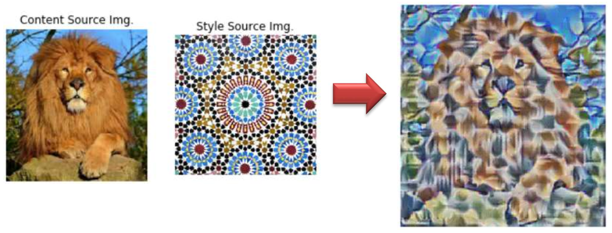

# Style-transfer
A repository containing scripts and reports pertaining to a school assignment about style transfer.

Neural style transfer is an optimization technique used to take two images—a content image and a style reference image (such as an artwork by a famous painter)—and blend them together so the output image looks like the content image, but “painted” in the style of the style reference image. Take a look at the examples given below. 

For more details about the math behind neural style transfer, please refer to the assignment report.

